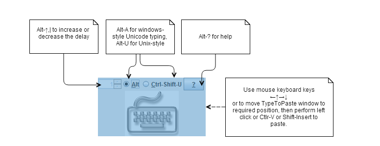

Usage
=====

1. Select and copy the text to clipboard
2. Press keyboard shortcut that you defined for TypeToPaste (Ctrl+Alt+C by default). The half-transparent window will appear under your mouse pointer. 
3. Move mouse to position where you have to paste the text and click left mouse button. Alternatively you can use  ←↑→↓ to locate the pasting position and Ctrl-V or Shift-Insert to perform paste.
4. Use Alt+↑ and Alt+↓ to ajust typing dealy if needed.
5. Use Alt-A or Alt-U to set method of typing Unicode characters.  

See image for more details:

